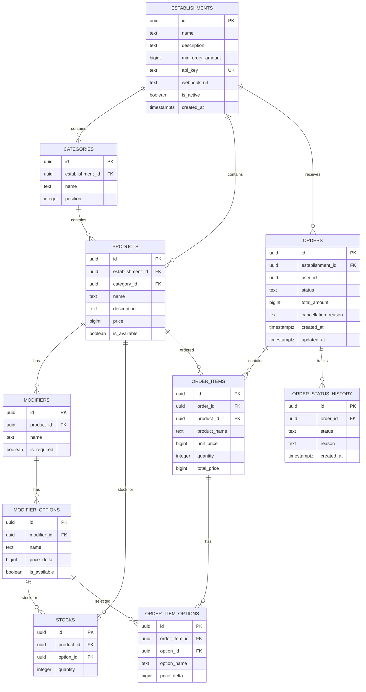

# Авито.Кухня MVP

Тестовое задание на стажировку Backend — осенняя волна 2026.

**Авито.Кухня** — MVP сервиса заказа еды через площадку Авито. Система предоставляет API для клиентской части и закрытый Partner API для заведений, а также содержит демонстрационный сервис заведения, показывающий интеграцию с платформой.

Основная цель проекта — продемонстрировать подход к проектированию backend-системы, API, модели данных и взаимодействию с внешними заведениями с учётом дальнейшего масштабирования.

---

# Возможности

## Пользовательский API

Пользователь может:

* просматривать список доступных заведений;
* получать меню выбранного заведения;
* просматривать категории и товары;
* выбирать товары и модификаторы;
* создавать заказ;
* получать информацию о заказе;
* отслеживать текущий статус заказа;
* отменять заказ до начала приготовления.

Авторизация и аутентификация пользователей в рамках MVP не реализованы согласно условиям задания.

Для идентификации пользователя API использует переданный `user_id`.

## Partner API

Заведение может:

* синхронизировать меню;
* создавать и обновлять категории;
* создавать и обновлять товары;
* управлять модификаторами и их вариантами;
* синхронизировать остатки товаров;
* получать информацию о заказах;
* изменять статус заказа;
* отменять заказ при невозможности его выполнения.

Доступ к Partner API предполагается как закрытый. В MVP для идентификации заведения используется API key.

## Webhook

После создания заказа платформа отправляет заведению webhook-событие:

```text
order.created
```

Демонстрационный сервис `restaurant-example` принимает это событие и имитирует обработку заказа заведением.

---

# Основные бизнес-сценарии

## Сценарий пользователя

```text
Открыть Авито.Кухню
        ↓
Выбрать заведение
        ↓
Просмотреть меню
        ↓
Выбрать товары
        ↓
Выбрать модификаторы
        ↓
Проверить наличие товаров
        ↓
Оформить заказ
        ↓
Получить идентификатор заказа
        ↓
Отслеживать статус
        ↓
Получить заказ
```

### Проверка наличия

При оформлении заказа система проверяет актуальные остатки товаров и выбранных вариантов модификаторов.

Создание заказа и изменение остатков выполняются в рамках одной транзакции.

Если необходимого количества товара нет, заказ не создаётся.

## Отмена заказа

Пользователь может отменить заказ только до начала приготовления.

Таким образом, отмена разрешена для соответствующих ранних статусов и запрещена после перехода заказа в `cooking`.

---

## Сценарий заведения

```text
Заведение подключается к платформе
        ↓
Синхронизирует меню
        ↓
Передаёт актуальные остатки
        ↓
Получает webhook о новом заказе
        ↓
Подтверждает заказ
        ↓
Начинает приготовление
        ↓
Передаёт заказ в доставку
        ↓
Завершает заказ
```

---

# Архитектура

Система состоит из двух приложений:

## kitchen-api

Основной backend платформы.

Отвечает за:

* каталог заведений;
* меню;
* категории;
* товары;
* модификаторы;
* остатки;
* оформление заказов;
* управление статусами;
* историю заказов;
* взаимодействие с заведениями;
* отправку webhook-событий.

## restaurant-example

Демонстрационный сервис заведения.

Отвечает за:

* публикацию тестового меню;
* передачу данных в `kitchen-api`;
* передачу остатков;
* получение webhook-уведомлений;
* имитацию изменения статусов заказа.

Сервис является отдельным приложением и запускается вместе с платформой через Docker Compose.

---

# C4 Diagram

Для описания архитектуры используется C4-модель.

Диаграмма контейнеров находится в репозитории в виде code-generated диаграммы:

```text
docs/c4-container.puml
```

Основные контейнеры:

```text
Client
   │
   ▼
kitchen-api
   │
   ├──────────────► PostgreSQL
   │
   └──────────────► restaurant-example
```

`kitchen-api` является центральным контейнером системы, через который проходят пользовательские запросы и взаимодействие с заведениями.

---

# Архитектурный стиль

Используется классическая слоистая архитектура:

```text
HTTP Handler
      ↓
Service Layer
      ↓
Repository Layer
      ↓
PostgreSQL
```

Ответственность слоёв:

### Handler

Отвечает за:

* HTTP endpoints;
* чтение параметров запросов;
* валидацию входных данных;
* формирование HTTP-ответов;
* преобразование ошибок в HTTP status codes.

### Service

Содержит бизнес-логику:

* создание заказа;
* проверку доступности товаров;
* расчёт стоимости;
* изменение остатков;
* проверку допустимости переходов статусов;
* отмену заказа;
* взаимодействие с webhook.

### Repository

Отвечает за работу с PostgreSQL:

* чтение данных;
* создание и обновление сущностей;
* транзакции;
* блокировки строк;
* выполнение SQL-запросов.

### PostgreSQL

Используется как основное постоянное хранилище данных.

---

# Модель данных

Для хранения данных используется PostgreSQL.

Основные сущности:

* `establishments` — заведения-партнёры;
* `categories` — категории меню;
* `products` — товары;
* `modifiers` — модификаторы товаров;
* `modifier_options` — варианты модификаторов;
* `stocks` — остатки товаров и вариантов модификаторов;
* `orders` — заказы;
* `order_items` — позиции заказа;
* `order_item_options` — выбранные варианты модификаторов;
* `order_status_history` — история изменения статусов.

## ER-диаграмма



## Связи сущностей

### Заведение и меню

Одно заведение содержит множество категорий

Категория содержит множество товаров

### Модификаторы

Товар может иметь несколько модификаторов

Каждый модификатор содержит варианты, например:

```text
Бургер
├── Размер
│   ├── Стандарт
│   └── Большой
└── Добавки
    ├── Сыр
    └── Бекон
```

### Остатки

Таблица `stocks` используется для хранения остатков:

* товаров;
* вариантов модификаторов.

Одна запись `stocks` относится только к одному из этих типов.

Это обеспечивается ограничением:

```sql
CHECK ((product_id IS NOT NULL) <> (option_id IS NOT NULL))
```

### Заказы

Заказ принадлежит заведению

Один заказ содержит несколько позиций

Каждая позиция содержит ссылку на исходный товар.

`user_id` не имеет внешнего ключа, поскольку пользовательская система и авторизация находятся за пределами MVP.

### История статусов

Для каждого заказа хранится история его состояний, например:

```text
created
   ↓
confirmed
   ↓
cooking
   ↓
ready
   ↓
delivering
   ↓
delivered
```

---

# Snapshot заказа

При создании заказа данные товара и выбранных модификаторов копируются в таблицы заказа.

Для товара сохраняются:

* `product_name`;
* `unit_price`;
* `quantity`;
* `total_price`.

Для выбранного варианта модификатора:

* `option_name`;
* `price_delta`.

Это позволяет сохранить историческое состояние заказа независимо от дальнейших изменений меню.

---

# Статусы заказа

Поддерживаются следующие статусы:

```text
created
confirmed
cooking
ready
delivering
delivered
cancelled
```

Допустимые переходы:

```text
created ───────► confirmed
   │
   └───────────► cancelled

confirmed ─────► cooking
   │
   └───────────► cancelled

cooking ───────► ready

ready ─────────► delivering

delivering ────► delivered
```

Переходы статусов проверяются на уровне бизнес-логики.

Отмена заказа после начала приготовления не допускается.

---

# Транзакционность заказа

Создание заказа выполняется атомарно.

В рамках одной транзакции:

1. проверяется существование заведения;
2. проверяются товары и модификаторы;
3. проверяется доступность товаров;
4. блокируются необходимые записи остатков;
5. проверяется достаточное количество;
6. рассчитывается итоговая стоимость;
7. создаётся заказ;
8. создаются позиции заказа;
9. создаются выбранные модификаторы;
10. уменьшаются остатки;
11. создаётся первая запись истории статуса.

Если любой этап завершается ошибкой, транзакция откатывается.

Для предотвращения ситуации, когда два параллельных заказа одновременно списывают один и тот же остаток, используются блокировки строк PostgreSQL.

---

# Деньги

Все денежные значения хранятся в `bigint` в минимальных денежных единицах.

---

# UUID

Для основных сущностей используются UUID.

Преимущества:

* отсутствие зависимости от последовательных ID;
* удобная генерация идентификаторов на уровне приложения;
* отсутствие необходимости координировать последовательности при потенциальном масштабировании;
* удобная интеграция с внешними системами.

---

# Интеграция с заведением

Взаимодействие с заведением осуществляется через Partner API.

Основные операции:

```text
kitchen-api
    │
    ├── синхронизация меню ───────► restaurant-example
    │
    ├── синхронизация остатков ──► restaurant-example
    │
    └── webhook order.created ◄── restaurant-example
```

После оформления заказа:

```text
User
 │
 ▼
kitchen-api
 │
 │ create order
 ▼
PostgreSQL
 │
 │ order.created
 ▼
restaurant-example
```

`restaurant-example` предоставляет демонстрационную реализацию внешнего заведения и запускается вместе с платформой через Docker Compose.

---

# Диаграммы

В репозитории представлены code-generated диаграммы, описывающие пользовательские сценарии и архитектуру системы.

## CJM пользователя

CJM описывает основной путь пользователя:

```text
Открытие сервиса
      ↓
Выбор заведения
      ↓
Просмотр меню
      ↓
Выбор товара
      ↓
Проверка доступности
      ↓
Настройка модификаторов
      ↓
Оформление заказа
      ↓
Отслеживание статуса
      ↓
Получение заказа
```

Также предусмотрен альтернативный сценарий:

* выбранный товар недоступен → пользователь выбирает другой товар;
* пользователь может отменить заказ до начала приготовления.

Исходная диаграмма находится в репозитории в формате PlantUML.

## CJM заведения

CJM заведения описывает процесс взаимодействия партнёра с платформой:

```text
Подключение
      ↓
Синхронизация меню
      ↓
Синхронизация остатков
      ↓
Получение webhook
      ↓
Проверка возможности выполнить заказ
      ├── Да → confirmed → cooking → ready
      │                         ↓
      │                    delivering
      │                         ↓
      │                    delivered
      │
      └── Нет → cancelled
```

Диаграмма также содержит альтернативный сценарий, при котором заведение не может выполнить заказ и отменяет его.

Исходная диаграмма находится в репозитории в формате PlantUML.

## C4 Container Diagram

Для описания архитектуры системы используется C4 Container Diagram.

Основные участники и контейнеры:

* **Пользователь** — инициирует пользовательские сценарии;
* **Web Client** — клиентская часть MVP;
* **Kitchen API** — основной backend платформы;
* **PostgreSQL** — постоянное хранилище данных;
* **Restaurant Example** — демонстрационный сервис заведения-партнёра.

Основной поток взаимодействия:

```text
Пользователь
     ↓
Web Client
     ↓ REST
Kitchen API
     ↓
PostgreSQL

Kitchen API ←──── REST ──── Restaurant Example
     │
     └──────── webhook ─────► Restaurant Example
```

`Kitchen API` является центральным компонентом системы. Через него проходят пользовательские запросы, работа с базой данных и интеграция с заведениями.

`Restaurant Example` является отдельным сервисом и демонстрирует реальное взаимодействие внешнего партнёра с платформой.

Диаграмма выполнена в формате PlantUML.


---

# API

API описан с помощью OpenAPI Specification.

Спецификация находится в репозитории:

```text
api/openapi.yaml
```

---

# Технический стек

* **Go** — основной язык разработки;
* **PostgreSQL** — база данных;
* **Docker Compose** — запуск всех сервисов;
* **Goose** — миграции базы данных;
* **OpenAPI** — описание HTTP API;
* **PlantUML** — архитектурные и CJM-диаграммы;
* **golangci-lint** — статический анализ и контроль качества кода.

---

# Качество кода

Для статического анализа используется `golangci-lint`.

Конфигурация линтера находится в репозитории.

Проверка:

```bash
golangci-lint run
```

Перед запуском проекта рекомендуется выполнить проверку линтером.

---

# Запуск

Для запуска всей системы:

```bash
docker-compose up --build
```

Docker Compose запускает:

```text
kitchen-api
restaurant-example
postgres
```

Проверка работоспособности:

```bash
curl http://localhost:8080/health
```

Получение списка заведений:

```bash
curl http://localhost:8080/api/v1/establishments
```

Получение меню:

```bash
curl http://localhost:8080/api/v1/establishments/{id}/menu
```

Создание заказа:

```bash
curl -X POST http://localhost:8080/api/v1/orders
```

Полный перечень endpoints и схем запросов находится в OpenAPI-спецификации.

---

# Тестирование

Проект содержит интеграционные и HTTP-тесты с использованием реального PostgreSQL.

Запуск всех тестов:

```bash
go test ./...
```
Сервисные тесты:

```bash
go test ./internal/kitchen/service -v
```

HTTP-тесты:

```bash
go test ./internal/kitchen/handler -v
```

Проверка конкурентного списания:

```bash
go test ./internal/kitchen/service -run TestCreateOrderConcurrency -v
```

Многократный запуск:

```bash
go test ./internal/kitchen/service -run TestCreateOrderConcurrency -count=20
```

Тесты проверяют:

создание заказа;
бизнес-валидацию;
доступность товаров;
минимальную сумму заказа;
переходы статусов;
отмену;
HTTP API;
Partner API;
обработку ошибок;
корректное списание остатков;
конкурентное создание заказов при ограниченном остатке.

---

# Возможное развитие после MVP

При переходе к production-решению систему можно развивать в следующих направлениях:

### Надёжность webhook

Использовать:

* Outbox Pattern;
* retry с exponential backoff;
* идемпотентность событий;
* dead-letter queue.

### Масштабирование

Возможные решения:

* кэширование меню;
* read replicas PostgreSQL;
* очередь сообщений;
* горизонтальное масштабирование `kitchen-api`.

### Безопасность

Добавить:

* аутентификацию пользователей;
* авторизацию;
* полноценную систему credentials для заведений;
* ротацию API keys;
* rate limiting.

### Наблюдаемость

Добавить:

* метрики;
* централизованные логи;
* distributed tracing;
* мониторинг webhook;
* алерты.

---

# Документация

В репозитории присутствуют необходимые материалы:

* OpenAPI спецификация;
* миграции базы данных;
* ER-диаграмма;
* C4 Container Diagram;
* CJM пользователя;
* CJM заведения;
* демонстрационный сервис `restaurant-example`.

Проект запускается одним Docker Compose и содержит полный демонстрационный сценарий взаимодействия платформы с заведением.
